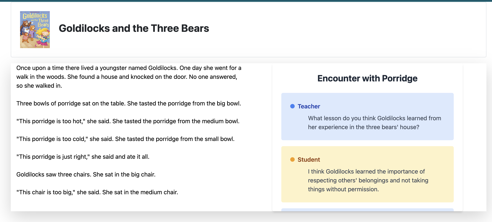

# generate-synthetic-conversation-app

This repository contains code for a Synthetic Conversation App. Follow the steps below to get started:

1. Clone the repository:
   ```bash
   git clone <repository-url>
   cd <repository-folder>
   ```

2. Set up the environment:
   - Create a virtual environment and activate it.
   - Install the required dependencies:
     ```bash
     pip install -r requirements.txt
     ```

3. Set up the environment variables:
   - Create a `.env` file in the root directory.
   - Add your OpenAI API key to the `.env` file:
     ```
     OPENAI_API_KEY=your-api-key-here
     ```

4. Run the Flask app:
   ```bash
   python app.py
   ```

5. Access the app:
   - Open a web browser and go to `http://localhost:5000/` to view the app.

6. Test the API key:
   - Run the test script to ensure the API key is set up correctly:
     ```bash
     python test.py
     ```

7. Interact with the app:
   - Click on the text in the passage to generate a dialogue based on the clicked content.

